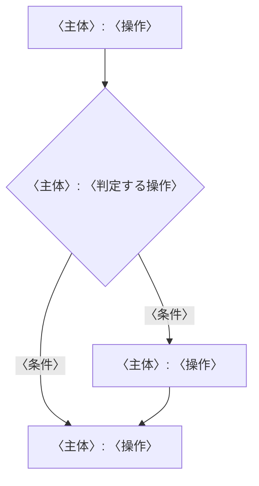
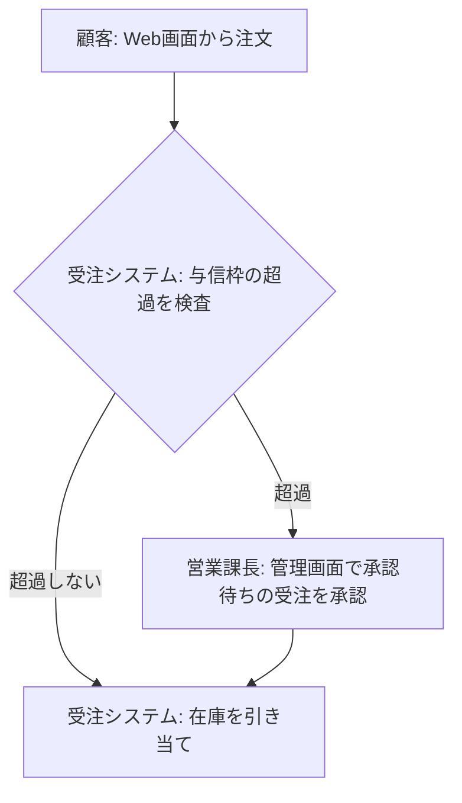
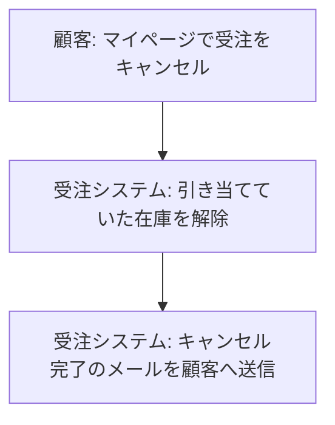
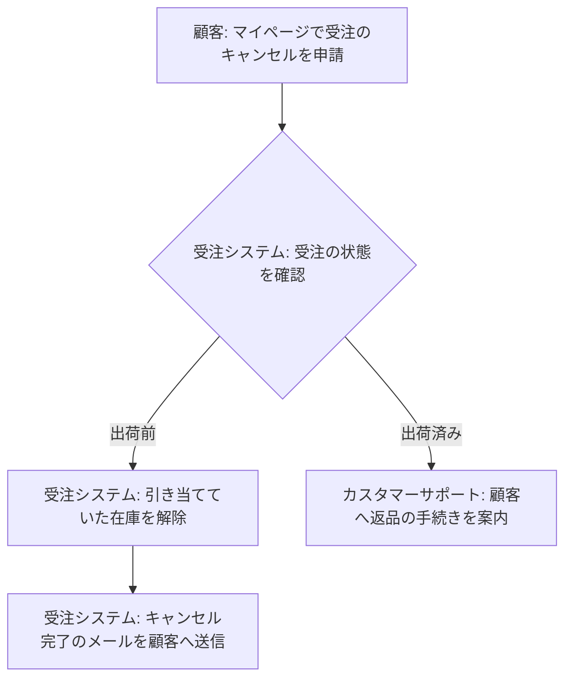

# 書式

### domain-<領域名>/SKILL.md
```markdown
---
name: domain-<領域名>
description: 〈業務用語を3つ以上含めて〉について質問・相談された際に使う。〈この領域特有の用語〉の意味や業務ルールを確認したい場合にも使う。
---

# 〈領域の日本語名〉ドメイン知識

〈この領域が扱う業務を1〜2文〉

## 使い方
次の場面では、**このファイルと同じディレクトリにある該当ファイルを読んでから回答する**。読まずに推測で答えない。

| 読むファイル | 読む場面 |
| --- | --- |
| `glossary.md` | 用語・コード値の意味を答えるとき |
| `rules.md` | 計算・制約・状態遷移の条件を答えるとき |
| `flows.md` | 誰がいつ何をするかの流れを答えるとき |
| `entities.md` | 業務上のモノの関係を答えるとき |

この領域に無い用語・ルールを聞かれたら、`domain-common` の skill を読む。
```
description はコードのパス名ではなく**業務の言葉**で書く。
表には実在するファイルだけを載せる（作らなかったファイルの行は消す）。

### glossary.md
```markdown
| 用語 | コード上の名前 | 意味 |
| --- | --- | --- |
| 引当 | `allocate` / `Stock.allocated` | 受注に対して在庫を確保すること |
| 顧客区分 | `Customer.kbn` | "1": 個人、"2": 法人 |
```

### rules.md
```markdown
| ID | ルール名 | 内容 | 理由 |
| --- | --- | --- | --- |
| R-01 | 〈ルール名〉 | 〈条件と結果。境界値を含める（以上/超など）〉 | 〈回答・コメント・設計書で得た理由。無ければ空欄〉 |
```
1ファイルに表は1つ。1ルール1行とし、セル内で改行しない。SKILL.md の「記述のルール」に従い、業務の言葉で書く。

### flows.md
フローごとに、番号付きの手順と、その手順から作った Mermaid の図を書く。手順が正、図は手順を図にしたもの。

````markdown
## F-01 〈フロー名〉
1. 〈主体〉: 〈操作〉
2. 〈主体（人・別システム）〉: 〈判定する操作〉（〈条件〉なら 3 へ、〈条件〉なら 4 へ）
3. 〈主体〉: 〈操作〉
4. 〈主体〉: 〈操作〉


````

#### 手順
- 主体にはシステム外の人・部署・別システムも書く。システムは業務上の呼び名で書く（例: ×`引当バッチ（別リポジトリ）` → ○`受注システムとは別のシステム`）。
- 操作は「〜する」を付けず体言止めで簡潔に書く（例: `受注システム: 与信枠の超過を検査`、`営業課長: 管理画面で承認待ちの受注を承認`）。
- 分岐する手順には、行末に `（〈条件〉なら N へ、〈条件〉なら M へ）` を書く。
- 分岐の無い手順は次の番号へ進むものとし、行き先を書かない。次の番号以外へ進む場合だけ、行末に次のどちらかを書く。
  - `（N へ）`: 次の番号以外の手順へ進む
  - `（終了）`: その手順でフローが終わる（最後の番号の手順には書かない）
- 条件は境界値を含めて書く（以上/超など）。条件の内容は rules.md のルールと一致させる。

#### 図
- 図の種類は `flowchart TD` に固定する。
- 手順1つを1つの箱にする。ノードIDは手順番号に合わせて `S1`, `S2`, … とする。
- 箱の文言は手順の「〈主体〉: 〈操作〉」と同じ文字列にし、必ず `"..."` で囲む（`;`・括弧・コロンなどの記号で図が壊れるのを防ぐ）。
- 分岐する手順はひし形 `{"..."}` にし、矢印に条件を書く（`-- 〈条件〉 -->`）。条件の文言は手順の括弧内と同じにする。
- 分岐の無い手順は、行き先が書かれていなければ次の番号の手順へ矢印を引く。`（N へ）` なら `SN` へ矢印を引く。`（終了）` の手順と最後の番号の手順からは矢印を引かない。

#### 書かないもの（Non-goals）
- 手順に無い主体・操作・分岐・条件を図に足さない。図で分かりやすくしたくなったら、まず手順を直し、図は手順から作り直す。
- 図に色・スタイル・クリック・リンク・注釈（`style`・`classDef`・`click`・`note` など）を付けない。
- 図の中にもコード上の名前・ファイルパス・コード値・技術用語を書かない（SKILL.md の「記述のルール」は図にも適用する）。
- `sequenceDiagram` などの別の図の種類や、`subgraph` によるレーン分けを使わない。

#### 例
入力（下書きで確定した手順）:
- 顧客が Web画面から注文する
- 受注システムが与信枠の超過を検査する。超過した受注は営業課長が管理画面で承認する
- 超過しない受注と承認された受注は、受注システムが在庫を引き当てる

出力:
````markdown
## F-01 受注承認
1. 顧客: Web画面から注文
2. 受注システム: 与信枠の超過を検査（超過なら 3 へ、超過しないなら 4 へ）
3. 営業課長: 管理画面で承認待ちの受注を承認
4. 受注システム: 在庫を引き当て


````

分岐の無いフローの出力:
````markdown
## F-02 受注キャンセル
1. 顧客: マイページで受注をキャンセル
2. 受注システム: 引き当てていた在庫を解除
3. 受注システム: キャンセル完了のメールを顧客へ送信


````

分岐した先がそれぞれ別の場所で終わるフローの出力:
````markdown
## F-03 顧客によるキャンセル
1. 顧客: マイページで受注のキャンセルを申請
2. 受注システム: 受注の状態を確認（出荷前なら 3 へ、出荷済みなら 5 へ）
3. 受注システム: 引き当てていた在庫を解除
4. 受注システム: キャンセル完了のメールを顧客へ送信（終了）
5. カスタマーサポート: 顧客へ返品の手続きを案内


````

### entities.md
```markdown
| エンティティ | 関係 | 相手 |
| --- | --- | --- |
| 受注 | 1対多で持つ | 受注明細 |
```

### open-questions.md
```markdown
## 状態
| 状態 | 意味 |
| --- | --- |
| 回答不明 | 質問したが「分からない」「担当者に確認しないと不明」などで回答が得られなかった |
| 未質問 | 質問が必要と判断したが、ユーザーが途中で質問を打ち切ったため、まだ質問していない（次回の更新時に質問する） |

## domain-〈領域名〉
| 状態 | 質問 | 背景 | 決まると更新されるファイル |
| --- | --- | --- | --- |
| 回答不明 | 〈質問文〉 | 〈参照元の場所と、そこに何が書かれている・何が起きているか〉 | domain-order/rules.md |
```
先頭の「状態」の表は常にこの内容で書く（片方の状態の質問が0件でも省略しない）。質問が0件の領域の節は書かない。
