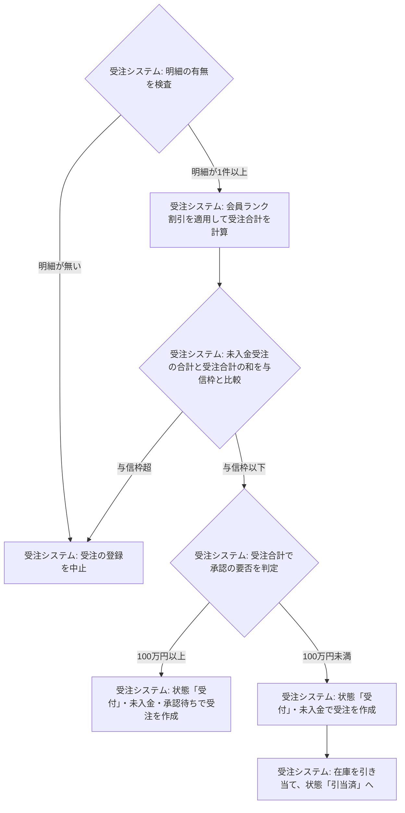
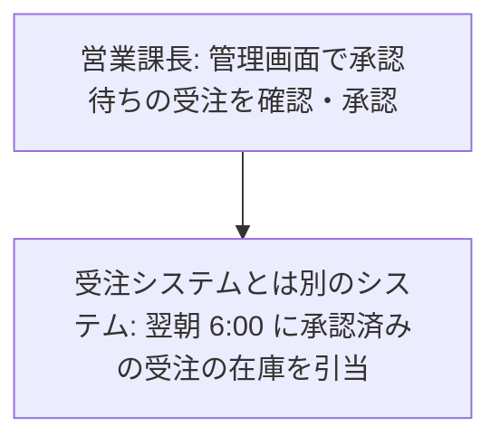
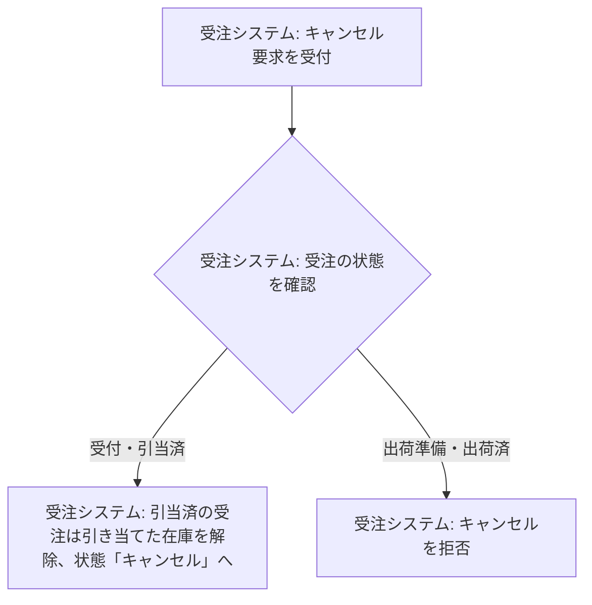
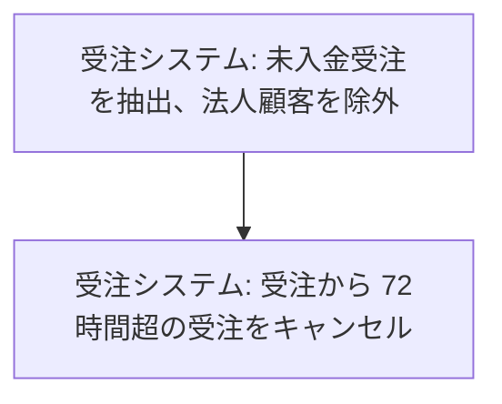

## F-01 受注登録
1. 受注システム: 明細の有無を検査（明細が1件以上なら 2 へ、明細が無いなら 8 へ）
2. 受注システム: 会員ランク割引を適用して受注合計を計算
3. 受注システム: 未入金受注の合計と受注合計の和を与信枠と比較（与信枠以下なら 4 へ、与信枠超なら 8 へ）
4. 受注システム: 受注合計で承認の要否を判定（100万円以上なら 5 へ、100万円未満なら 6 へ）
5. 受注システム: 状態「受付」・未入金・承認待ちで受注を作成（終了）
6. 受注システム: 状態「受付」・未入金で受注を作成
7. 受注システム: 在庫を引き当て、状態「引当済」へ（終了）
8. 受注システム: 受注の登録を中止

## F-02 高額受注の承認
1. 営業課長: 管理画面で承認待ちの受注を確認・承認
2. 受注システムとは別のシステム: 翌朝 6:00 に承認済みの受注の在庫を引当

## F-03 受注のキャンセル
1. 受注システム: キャンセル要求を受付
2. 受注システム: 受注の状態を確認（受付・引当済なら 3 へ、出荷準備・出荷済なら 4 へ）
3. 受注システム: 引当済の受注は引き当てた在庫を解除、状態「キャンセル」へ（終了）
4. 受注システム: キャンセルを拒否

## F-04 未入金受注の自動キャンセル
1. 受注システム: 未入金受注を抽出、法人顧客を除外
2. 受注システム: 受注から 72時間超の受注をキャンセル

